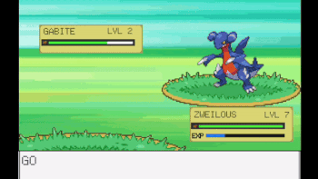
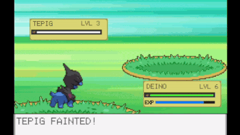
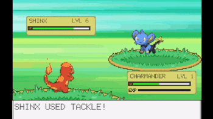
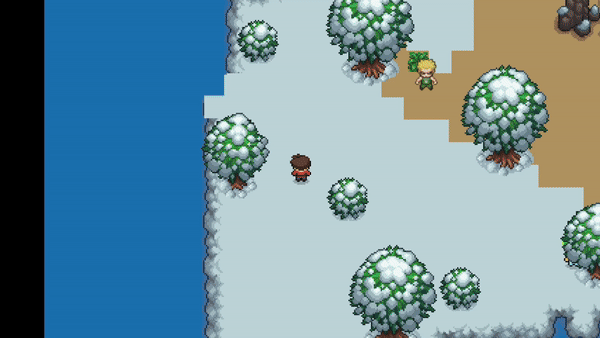

# 🎮 Pokémon Adventure Game

Welcome to my Pokémon Adventure Game! 🕹️ This project is a complex, feature-packed experience designed to bring the classic thrill of Pokémon battles, evolution, and exploration to the browser. Built in Unity with C#, this game combines strategic gameplay with dynamic AI mechanics for an immersive journey.

## 🌐 [Play the Game Online!](https://ayushbhanot.github.io/UnityPokemonGame-WebGLBuild/)

---

## 🚀 Project Overview

This game offers everything from AI-driven battles and Pokémon evolution to a comprehensive progression system. With elements like type effectiveness, battle animations, and an interactive leveling system, it’s a true Pokémon experience built from scratch.

---

## 📽️ Gameplay Highlights

<table>
  <tr>
    <td align="center"><strong>Catching Pokémon</strong><br></td>
    <td align="center"><strong>Evolution</strong><br></td>
  </tr>
  <tr>
    <td align="center"><strong>Battle Scene</strong><br></td>
    <td align="center"><strong>Trainer Battles</strong><br></td>
  </tr>
</table>

---

## 🔑 Key Features

### Turn-Based AI Battle System 🥊
Engage in strategic, turn-based battles against intelligent AI opponents. Choose from move sets, items, and Pokémon switching for a competitive edge.

### Leveling, Evolution, and Move Learning ⏫
As Pokémon level up, they unlock the potential to learn new moves and evolve into advanced forms, with type effectiveness and power stats influencing each battle's outcome.

### Pokémon Capture Mechanics 🎒
Experience the challenge of capturing Pokémon in the wild! Each encounter presents different levels and types, making every capture attempt unique.

### Comprehensive Pokémon Party Management 🧑‍🤝‍🧑
Dynamically switch Pokémon in and out of your party to adjust your strategy, giving you full control over team composition.

### Save and Load Game 💾
Keep your game progress intact with a saving system that allows you to continue your adventure right where you left off.
## 🛠️ Technology Stack

- **Unity** - Game development and rendering
- **C#** - Core game scripting and logic
- **WebGL Build** - Play the game directly in the browser

---

## 📚 Project Structure Highlights

Scripts are organized under the path: **`Assets/Pokemon-Ayush/Scripts`**. Here are some key components:

- **BattleSystem.cs**  
  Controls the entire battle sequence, including player and AI moves, turn-based logic, and action selection.

- **BattleDialog.cs**  
  Manages in-battle dialog, including text typing effects, move descriptions, and action selection for a responsive UI experience.

- **BattleHUD.cs**  
  Handles the heads-up display (HUD) during battles, including player and opponent health bars and experience points.

- **EvolutionManager.cs**  
  Manages Pokémon evolution sequences with smooth animations and UI transitions, including color fades and evolution text.

- **MapArea.cs**  
  Spawns random wild Pokémon encounters with initialized stats, providing variety in each encounter.

- **Move.cs** and **MovesBase.cs**  
  Define and manage Pokémon moves, including move types, power points (PP), and effectiveness based on the Pokémon type.

- **MoveSelectionUI.cs**  
  Displays available moves and PP, dynamically updating based on the player’s current selection and moves left in the battle.

- **HealthBar.cs**  
  Visualizes each Pokémon’s current health during battles, ensuring players can monitor their team’s status.

- **Pokemon.cs**  
  Manages core Pokémon properties, stats, evolution requirements, and damage calculations based on type effectiveness.

- **PokemonScript.cs**  
  Defines Pokémon data including names, types, stats, moves, and evolution details.

- **PartyMemberUI.cs**  
  Manages UI elements for each Pokémon in the party, displaying names, levels, and health for quick party management.

- **TypeChart.cs**  
  Provides type effectiveness logic, determining the advantage or disadvantage of moves based on Pokémon types.

---

## 🚩 Getting Started

To explore the code and understand the game’s structure:

1. **Clone the repo**  
   ```bash
   git clone https://github.com/ayushbhanot/UnityPokemonGame.git

2. **Open the project in Unity**

3. **Dive into the codebase** or make your own modifications!

Or, if you just want to play, [**Click Here to Play the Game Online!**](https://ayushbhanot.github.io/UnityPokemonGame-WebGLBuild/)

---

## 🎉 Enjoy the Game!

I hope you enjoy exploring the features and the complex code structure as much as I enjoyed creating it! Feel free to reach out if you’d like to discuss this project further.

Happy gaming! 🎮
